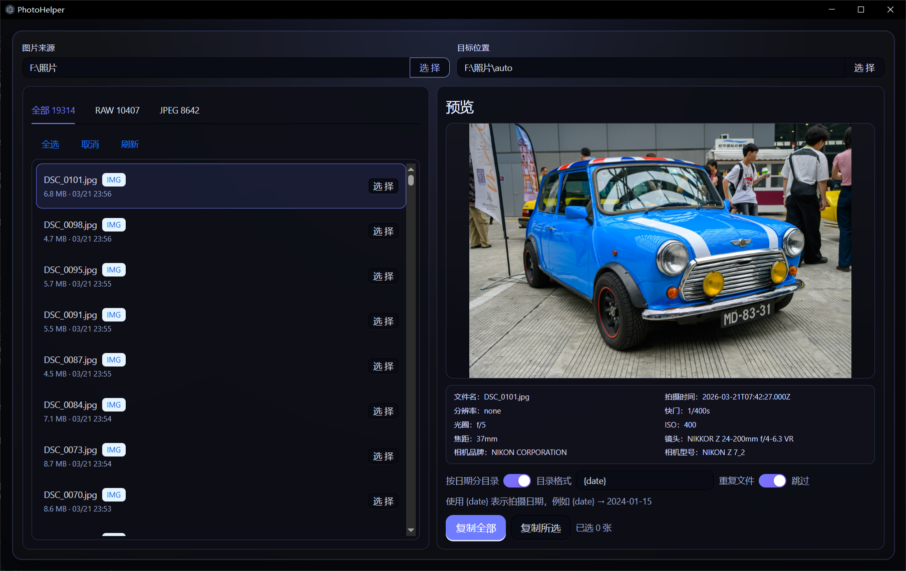

# PhotoHelper

照片管理工具，支持 SD 卡目录浏览、RAW 图片预览与拷贝。



## 功能特性

- **目录扫描** - 自动扫描文件夹，支持 RAW（JPEG、PNG、TIFF 等常见格式）
- **图片预览** - 支持 JPEG/PNG 图片直接预览，以及 RAW（NEF、ARW、CR2、DNG 等）格式预览
- **元数据读取** - 显示拍摄时间、分辨率、快门、光圈、ISO、焦距、镜头等信息
- **批量复制** - 支持按日期自动分目录、重复文件跳过或重命名
- **配置保存** - 自动保存图片来源、目标位置、选项设置

## 支持格式

| 类型 | 格式 |
|------|------|
| 图片 | JPEG, PNG, GIF, BMP, WebP, HEIC, HEIF, TIFF |
| RAW | DNG, ARW, NEF, NRW, CR2, CR3, RAF, RW2, ORF |

## 使用说明

### 开发模式

```bash
npm install
npm run dev
```

### 构建应用

```bash
npm run build
```

打包后的文件位于 `dist` 目录。

### 基本操作

1. **选择来源** - 点击「图片来源」的选择按钮，选择 SD 卡或照片目录
2. **浏览照片** - 在左侧列表查看照片，支持按全部/RAW/JPEG 筛选
3. **预览照片** - 点击列表项，右侧显示预览图和 EXIF 信息
4. **选择复制** - 点击「选择」按钮勾选要复制的照片，或使用「全选」
5. **设置选项** - 可开启按日期分目录、设置重复文件处理方式
6. **开始复制** - 点击「复制全部」或「复制所选」，照片将复制到目标目录

## 配置说明

| 选项 | 说明 |
|------|------|
| 按日期分目录 | 开启后按拍摄日期自动创建目录（如 `2024.01.15`） |
| 目录格式 | 使用 `{date}` 表示日期，如 `{date}` → `2024.01.15` |
| 重复文件 - 跳过 | 同名文件直接跳过 |
| 重复文件 - 重命名 | 同名文件自动重命名为 `photo(1).jpg` |

## 技术栈

- **前端** - React 19, TypeScript, Ant Design, Framer Motion
- **桌面** - Electron 41
- **构建** - Vite 5
- **RAW 解析** - dcraw-wasm, exifr

## 许可证

MIT
